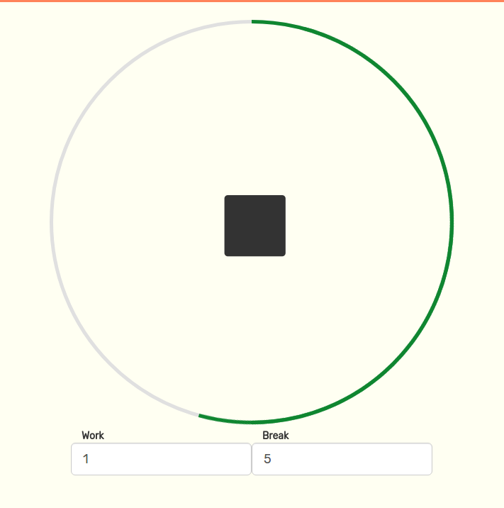

# PomodoroTime 

## Overview

PomodoroTime is a timekeeping app using the Pomodoro Method.

### Motivation
The app is intended to help users work productively and make the most of their time.

###What it does
The app operates by running timers in alternating work and break periods. When a work session is finished the user is prompted to record his thoughts and a break session begins. A timeline is kept of a user's app activity so that they can observe work patterns and progress they have made within the week.
### Technical Features
- Mobile Responsive UI
- AJAX
- Web Animations API
- User Authentication with PassportJS
- Google Charts API

### Tech Composition
PomodoroTime is a fullstack project using the Bootstrap library frontend and a Nodejs backend with MongoDB for database management.
Webpack is employed to enforce a modular structure in the frontend.

### API
Endpoints created for PomodoroTime are used to create accounts, login, logout, and update user information. The login endpoint is backed with authentication middleware to prevent malicious logins.

### Future Plans
Move from Mongoose to MongoDB driver, user portrait, email verification, and OAuth.

